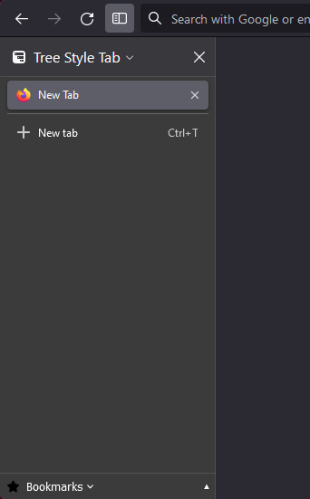
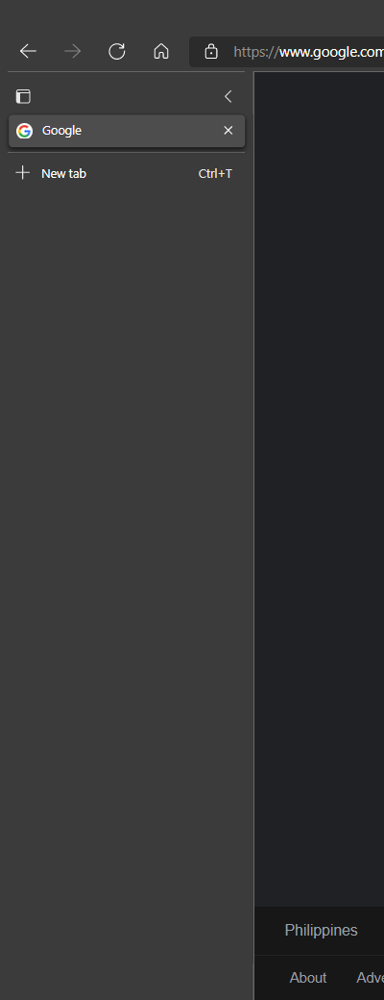
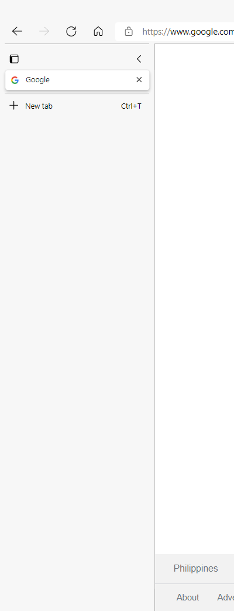
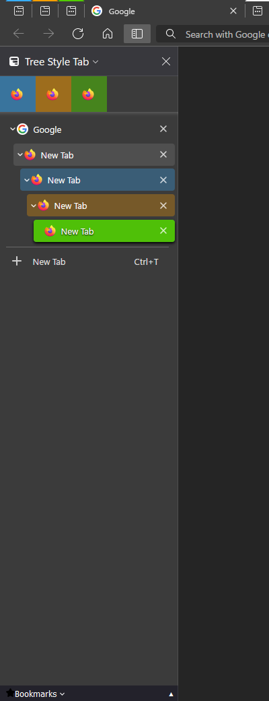
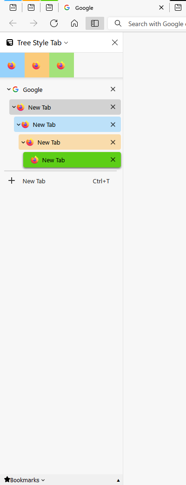

# Edge Mimicry - Tree Style Tab Theme (Beta)
A theme created for Tree Style Tab extension on Mozilla Firefox, that tries to replicate the vertical tab user interface of Microsoft Edge Browser

## Previews:
 
 
 

## Features include:
- support tab indention 
- support for tab-coloring based on its container
- follows your current firefox theme

## How to install:
1. You must have [Tree Style Tab](https://addons.mozilla.org/en-US/firefox/addon/tree-style-tab/) extension installed on Firefox.
2. Go to Firefox Add-Ons Manager > Tree Style Tab > Options , then click the :ballot_box_with_check: Unlock Expert Options.
3. On the Appearance section of the options page, choose the **"No Decorations"** to disable the built-in theme applied.
4. Scroll down on the options page until you find the "► Advanced" section and expand it. You will see a textfield there with a caption on the top **"Extra Style rules provided by Tree Style Tab"**.
5. Copy the entire code/content of the **treestyletab-edge-mimicry.css** and paste it on the textfield.
6. Close then open the sidebar to restart the tree style tab extension and to be able to load the theme correctly. Alternatively, you can also disable then enable the extension for it to properly load the css codes (and probably to reset the script handling for the pinned tabs, because there seems to be a problem with the pinned tabs layout when in "icons only" mode.)  

## Optional userChrome.css mods
If you want to also copy the hover feature of sidebar found on Microsoft Edge, then you can use the userChrome.css and other files included on the "edge-mimicry" folder. However, this sidebar mod will remove the resizeable feature since it uses a fixed width configuration.
## How to install userChrome.css mods:
1. You must have **toolkit.legacyUserProfileCustomizations.stylesheets** set to **true** on the **about:config** of Firefox. If you have not, then set it and restart firefox afterwards.
2. Go to **about:support** and find the **"Profile Directory"**. Click the **"open directory"** to navigate to your profile folder. Once you are at the profile folder, look for a folder named **"chrome"**, if it does not exist, then create one.
3. Copy-paste both **userChrome.css** and the files inside the "edge-mimicry" folder on the "chrome" folder. (If you already have your own userChrome.css, then just copy-paste the "@import..." line on my userChrome.css to your existing userChrome.css.)
4. Re-launch Firefox.

## Important Notes:
- Linux users may encounter problems with the tab layout and margins, along with the default theme. I am still investigating on how Firefox Linux handles browser theming since I primarily created and tested this mod on a Firefox installed on a windows machine.
- **Still in beta, since I'm still fixing some theming issue on Linux. Rest assured I'll update this repo once I'm done.**
- When pasting the code to **Extra Style Rules**, make sure to check the **"No Decorations"** on Appearance panel option as this theme doesn't go well with the built-in themes of Tree Style Tab.

## Notes/Credits:
- Some of my userChrome mods were originally forked from [MrOtherGuy's Collection of random CSS hacks for Firefox](https://github.com/MrOtherGuy/firefox-csshacks), specifically the [autohide_sidebar](https://github.com/MrOtherGuy/firefox-csshacks/blob/master/chrome/autohide_sidebar.css) and implemented my own mods to it.
