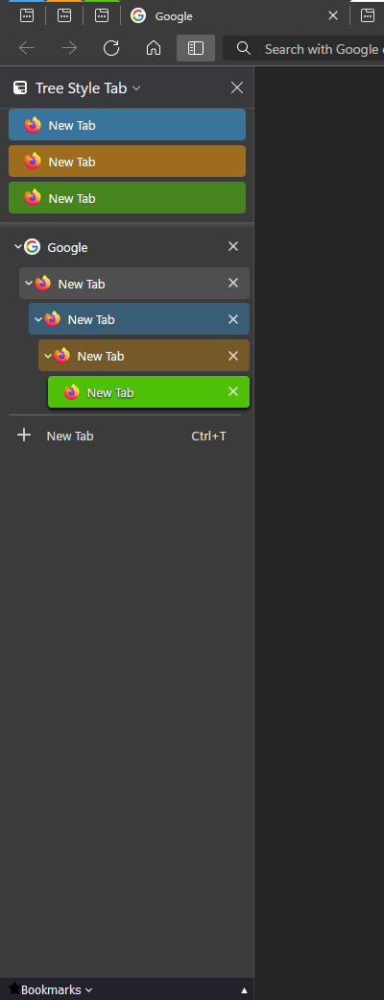
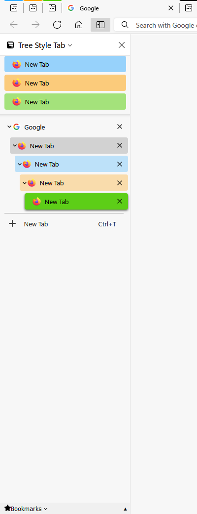

# Edge Mimicry - Tree Style Tab Theme
A theme created for Tree Style Tab extension on Mozilla Firefox, that tries to replicate the vertical tab user interface of Microsoft Edge Browser

## Previews:
 
 
 

## Features include:
- support tab indention (up to 8 levels)
- support for tab-coloring based on its container
- follows your current firefox theme
- built to handle different Firefox Sidebar configurations (so you can still use your own mods on userChrome without having to worry on breaking things on the tree style tab, well theoretically though if these mods are just as simple as changing the width, height, background etc. since I have no idea what kind of mods you've done on your userChrome sidebar.)

## Optional userChrome.css mods
If you want to also copy the hover feature of sidebar found on Microsoft Edge Browser, then you can use the userChrome.css and other files included on the "edge-mimicry" folder. However, this sidebar mod will remove the resizeable feature since it uses a fixed width configuration.

## Important Notes:
- When pasting the code to **Extra Style Rules**, make sure to check the **"No Decorations"** on Appearance panel option as this theme doesn't go well with the built-in themes of Tree Style Tab.

## Notes:
- The Tree Style Tab add-ons container (subpanel container) is left untouched, as I have no idea yet on what to do with it. But it is included in my to-do list. 
- Some of my userChrome mods were originally forked from [MrOtherGuy's Collection of random CSS hacks for Firefox](https://github.com/MrOtherGuy/firefox-csshacks), specifically the [autohide_sidebar](https://github.com/MrOtherGuy/firefox-csshacks/blob/master/chrome/autohide_sidebar.css) and implemented my own mods to it.
